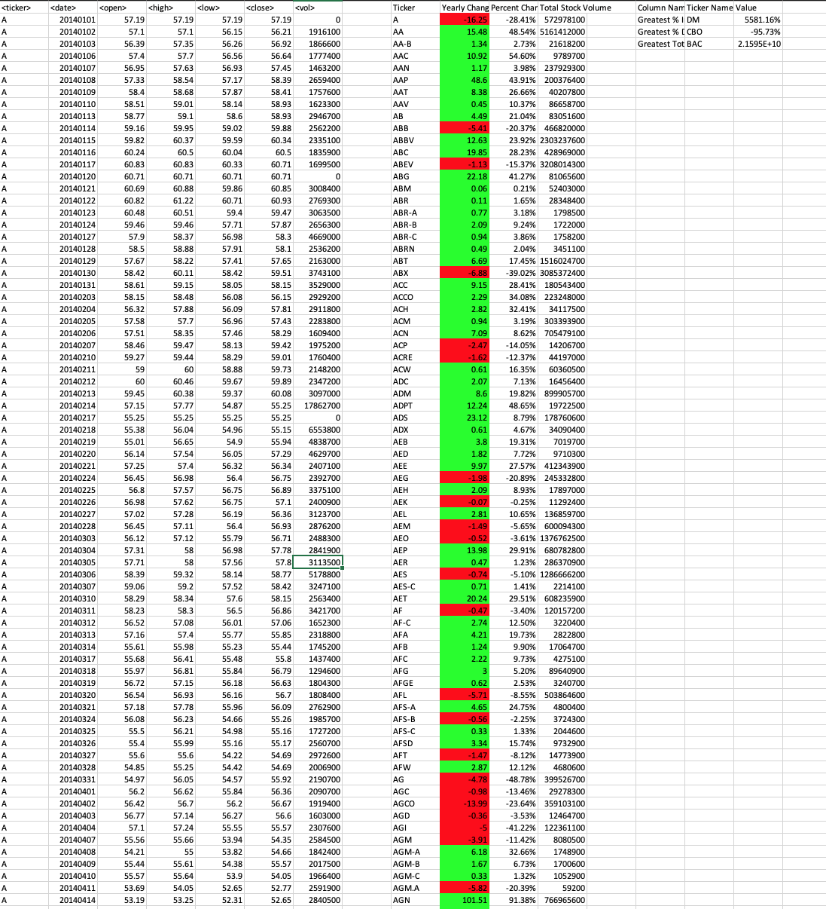
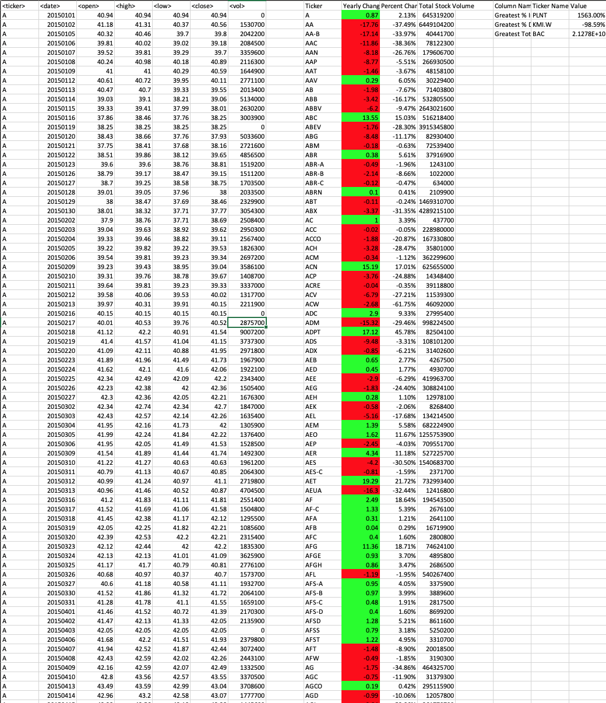
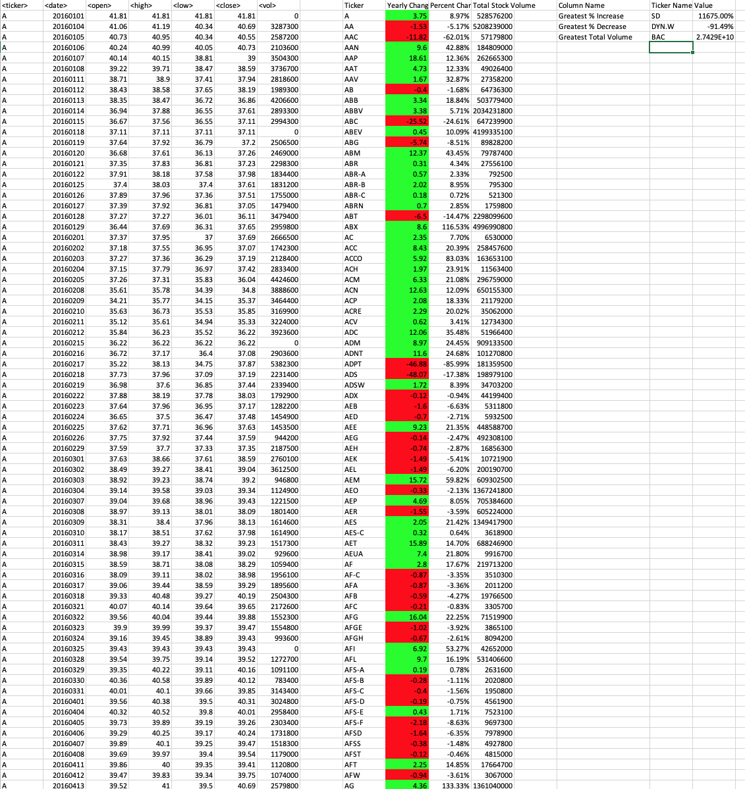

# VBA-challenge -The VBA of Wall Street
VBA-Challenge to make a Stock Market Analysis.

## Background
This project is a VBA scripting to analyze real stock market data.This analysis used two data-points one is the [Test Data ](./VBA_Alphabetical_testing/alphabetical_testing.xlsm) which is used while developing the script, and the other is [Stock Data](./VBA_Stock_data/Multiple_year_stock_data.xlsm) which is the main data to run the script. The data is sourced into Excel Microsoft Office, the test data have 7 sheets(A-P) the size of this file is smaller and used for testing. The stock data or the main data has three sheets categorized yearly 2014, 2015, 2016. This file is bigger in size, it may take time when you execute the script into the file. The VBA scripts also found in both data points file directories.

[Test Data ](./VBA_Alphabetical_testing/alphabetical_testing.vbs) vbs file &
[Stock Data](./VBA_Stock_data/Stock_Market_Analysiss.vbs) vbs file

Source: https://gfycat.com/babyishbetterhammerheadbird

## Solution 
The script loop through all the stocks data once and the following information displayed.

## Solution 1 Ticker Symbol

The script will sort the distinct ticker symbol in one column in column "I" with a column header "Ticker.

## Solution 2 Yearly Change

The script will excute Yearly change from opening price at the beginning of a given year to the closing price at the end of that year, and put the value on "J" column. For this task the code added a conditional formatting that highlighted positive change in green and negative change in red.

## Solution 3 Precent Change

The script also percent perform a change from opening price at the beginning of a given year to the closing price at the end of that year, and put the value on "K" column.

## Solution 4 Total stock Volume

The total stock volume also genereated on "L" column. 

## Solution 5 Greatest 
* At last not least the solution also provide the stock with the "Greatest % increase", "Greatest % decrease" and "Greatest total volume".

The solution look as follows:
## 2014 Stock Data

## 2015 Stock Data

## 2016 Stock Data

This Code is compiled and written for the VBA class Homework in the Data Analytics Bootcamp class given by-Trilogy Education Services at the University of Toronto,continuing studies. The code used learning resources from the class.

©2020 Trilogy Education Services
